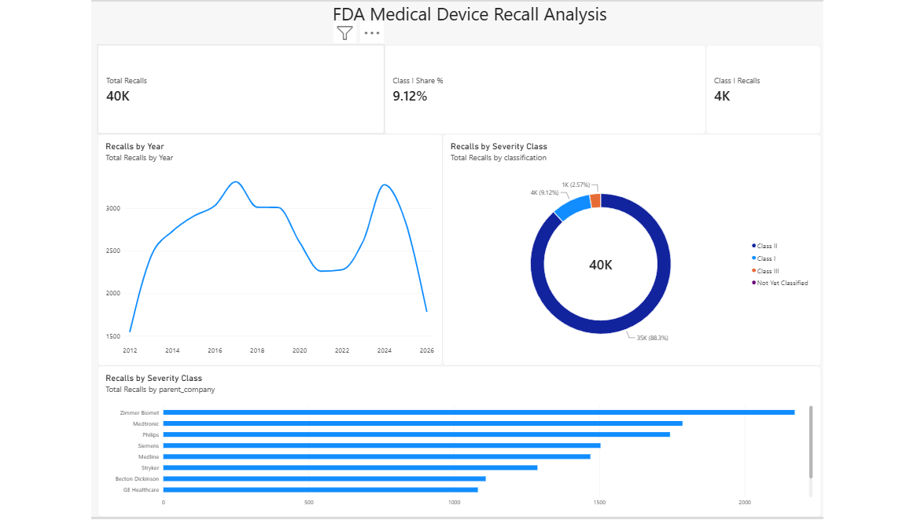
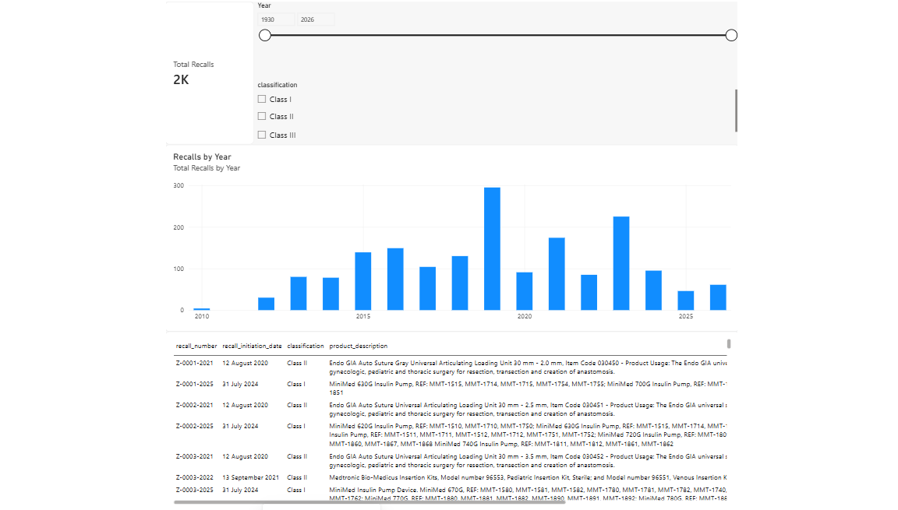
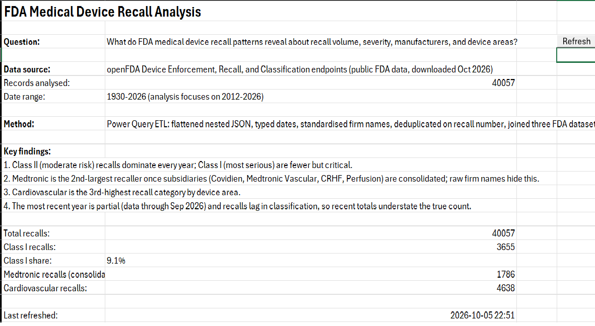
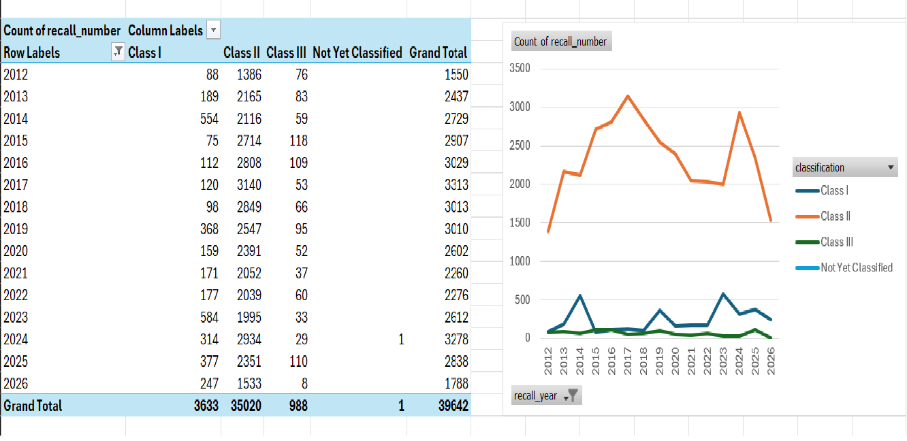

# FDA Medical Device Recall Analytics

An end-to-end analysis of U.S. FDA medical device recall data, built in Excel (Power Query, pivot tables, VBA) and Power BI (star-schema model, DAX, drill-through reporting).

## Question

What do FDA medical device recall patterns reveal about recall volume, severity, manufacturers, and device areas?

## Data source

Public data from the [openFDA](https://open.fda.gov/) API, three device endpoints:

- **Device Enforcement** (`/device/enforcement`) — the recall records, including classification (Class I/II/III), recalling firm, dates, and reason for recall. ~40,000 records.
- **Device Recall** (`/device/recall`) — used to obtain the FDA **product code** for each recall.
- **Device Classification** (`/device/classification`) — maps each product code to a device name and **medical specialty** (e.g. Cardiovascular, Orthopedic).

Data downloaded October 2026. Analysis covers all years in the data (1930–2026); charts focus on 2012 onward, where records are dense.

## Method

**ETL (Power Query):**
- Flattened a 423 MB nested JSON into a tabular model (expand step written in M where the GUI stalled on file size).
- Cleaned: parsed text dates to real dates, converted `"N/A"` to nulls, trimmed and removed non-printing characters, checked for duplicate recall numbers (none found).
- Standardised recalling-firm names by stripping legal suffixes (INC, LLC, GmbH, etc.).
- Joined the three FDA datasets on recall number and product code to attach medical specialty and FDA root-cause category. Product-code format mismatch (trailing dashes) normalised before joining. 99% of recalls matched a product code; 94% matched a medical specialty.
- Built a manual parent-company rollup for major corporate families (e.g. Covidien → Medtronic, CareFusion/Bard → Becton Dickinson), since recalls file under many subsidiary names.

**Excel analysis:**
- Pivot tables and charts: recalls by year and class, by manufacturer (raw and consolidated), by medical specialty.
- A lookup tool using XLOOKUP (product code → device details) and COUNTIFS (recall counts by company and severity).
- A one-page summary sheet with live formulas.

**VBA:**
- A short macro (`RefreshAndSummarize`), bound to a button, that refreshes all Power Query connections, updates the pivot caches, and writes a refresh timestamp to the summary sheet. A modest, honest automation of the refresh step.

**Power BI:**
- Star-schema model: `Recalls` fact table with `DimDate`, `DimManufacturer`, and `DimClass` dimension tables.
- DAX measures: total recalls, Class I count, Class I share, previous-year recalls, year-over-year change.
- Two report pages: an Overview (KPI cards, year trend, severity breakdown, top-10 companies) and a Manufacturer Detail drill-through page with year and class slicers.

## Key findings

- Class II (moderate risk) recalls dominate every year; Class I (most serious) are ~9% of all recalls.
- Cardiovascular is the third-highest recall category by device area.
- When subsidiaries are consolidated, Medtronic is the second-largest recaller — a pattern hidden in the raw firm names, which split its recalls across Covidien, Medtronic Vascular, CRHF, and Perfusion Systems.
- The most recent year is partial (data through Sep 2026) and recalls lag in classification, so recent totals understate the true count.

## Dashboards

**Power BI — Overview**

**Power BI — Manufacturer drill-through**

**Excel — Summary sheet**

**Excel — Analysis**

## Files

| File | What it shows |
|------|---------------|
| `fda_device_recalls.xlsm` | Excel workbook: Power Query ETL, pivots, charts, XLOOKUP/COUNTIFS lookup tool, summary sheet, VBA refresh macro |
| `fda_device_recalls.pbix` | Power BI report: star-schema model, DAX measures, Overview and drill-through pages |
| `extract_recall_codes.py` | Python script that streams the 1 GB device-recall JSON and extracts a slim recall-number → product-code lookup (uses `ijson`, never loads the full file into memory) |
| `screenshots/` | Images of the Excel and Power BI deliverables |

## Notes and limitations

- "Recalling firm" is the legal entity that filed the recall, not necessarily the parent manufacturer. The consolidated view addresses the largest corporate families only.
- Firm standardisation strips legal suffixes but does not merge distinct legal entities beyond the manual parent map.
- Raw FDA data files are not included in the repo due to size; download instructions are in the data-source links above.

## Author

Sarath Venkatesan — MSc Biomedical Engineering, Politecnico di Milano